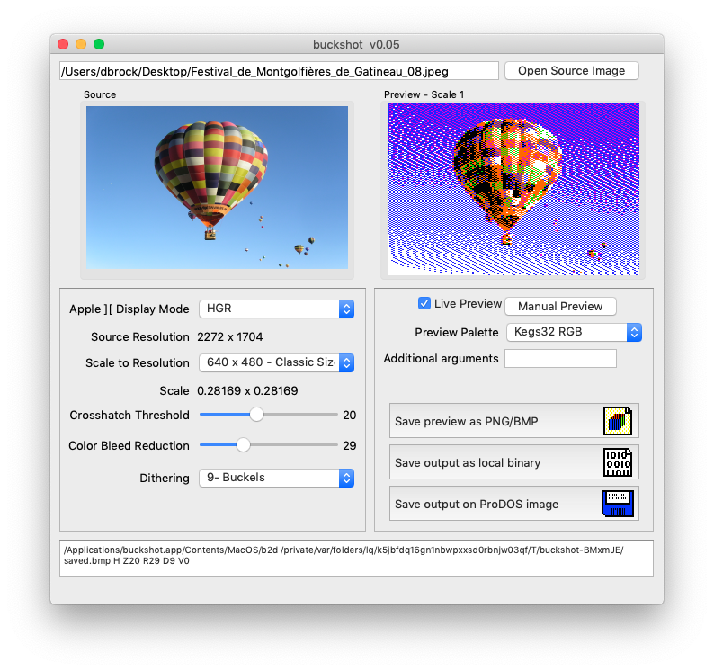

# buckshot
An image conversion tool for Mac OSX, Windows and Linux.  Take modern image formats (PNG, JPEG, BMP, etc) and convert them for use in your Apple II programs or just for fun.



# Usage
The fastest way to get started is to go here [https://apple2.gs/buckshot](https://apple2.gs/buckshot) where you can download the latest builds for Mac OSX, Windows and Linux.

Once you start the program, just "Open Source Image", select the "Apple ][ Display Mode" you want to convert your image to, and click "Preview", or even better, click the "Live Preview" checkbox to get real-time feedback on your conversion settings.  Once you are satisfied with your conversion settings, click "Save Image File" to save in one of the Apple ][ image formats based on the display mode.  If you want to save that image file directly to a ProDOS volume, that is now supported via the "Save To ProDOS" function!  Then you can load it up in your favorit emulator, or transfer it to real disks/flash storage to view on glorious vintage hardware.

# Build
This project is written in C++ using the Qt framework.  It calls out to two external binaries for image conversion ([http://www.appleoldies.ca/bmp2dhr/](b2d)) and ProDOS volume support ([http://www.brutaldeluxe.fr/products/crossdevtools/cadius/](CADIUS)).

You can build and run the project without it, but it won't be able to generate previews or save to ProDOS volumes without those 3rd-party binaries.  The authors of those projects are not involved with this project, but have graciously encouraged my integration attempts with this software.

You will need to copy the binaries of those two programs for your platform to the build directory you are running.

Example for Mac OSX "Release" build:
```
cp ../b2d build-buckshot-Desktop_Qt_5_7_0_clang_64bit-Release/buckshot.app/Contents/MacOS/
cp ../Cadius build-buckshot-Desktop_Qt_5_7_0_clang_64bit-Release/buckshot.app/Contents/MacOS/
```
In this example I obviously have the files stored in a parent directory outside of the project folder.

If you can't find/build those binaries for your platform, I suggest you just pull them out of the downloads available at [https://apple2.gs/buckshot](https://apple2.gs/buckshot).

# Disclaimer
This was largely built as a proof-of-concept, and I tried to put it together quite quickly (the original version was over the course of about a week or two.)  I would never suggest that this is ididiomatic C++ code or Qt code.  I am very results oriented and wrote a lot of this quite procedurally, as I went along adding all my planned features.  Please feel free to fork it and make fixes, clean it up, add in other converters, etc.  I probably won't have much time to tinker with this one from here on out, as I have most of the features I need for my own usage at this point. 


# Credits
I cannot begin to express my gratitude to the heavy lifters who authored the tools under-the-hood of buckshot.  

### bmp2dhr
Thanks to Bill Buckels, whose seminal work in image conversion routines has long inspired me to improve my own IIgs conversion routines. 

### CADIUS
Thanks to Brutal Deluxe, whose tools not only speed up my entire Apple II development pipeline, but also provides the ProDOS image support here.


